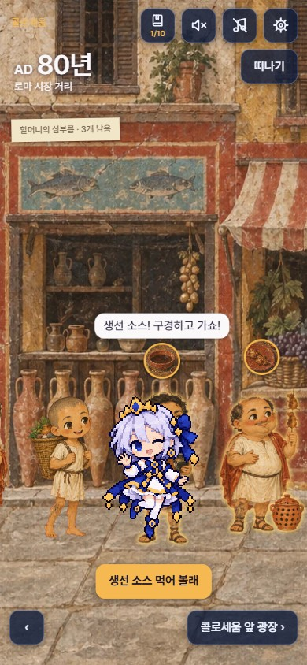
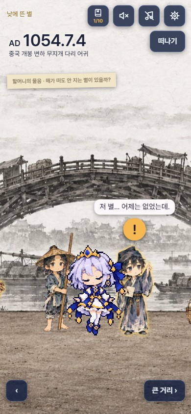
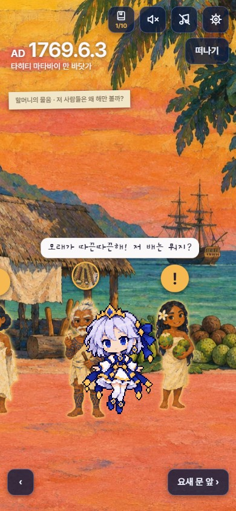
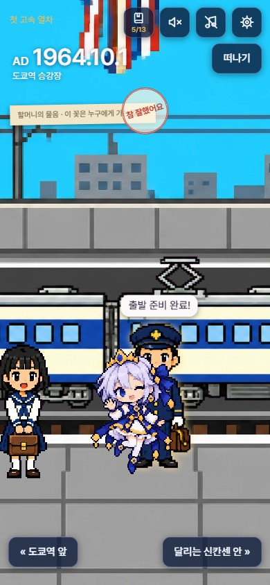

# Time Oddity — 시간 한량

할머니의 수첩을 들고 지난 날로 가서, 그날 그 거리를 걸어 다니며 사람들에게 말을 걸어 보는 교육용 게임이다.
[Space Oddity — 우주 한량](https://github.com/destory1984/oddity_claude)(1권)의 다음 편이다. 1권이 "못 가는 곳"이었다면 2권은 "못 가는 때"다.

## 해 보기

- 열어 보기: https://destory1984.github.io/time-oddity_claude/play/
- 손전화로 열면 가장 잘 맞는다. 설치, 계정, 광고가 없다. 한 일은 그 기기에만 남는다.
- 지금 판은 v0.1.111이다(2026.10.9). 갈 곳은 열이고, 한 곳을 다 보는 데 5분쯤 걸린다.

| 로마 AD 80 | 중국 개봉 1054 | 타히티 1769 | 도쿄 1964 |
|---|---|---|---|
|  |  |  |  |

## 지금 있는 것

| 때 | 곳 | 장면 셋 |
|---|---|---|
| AD 80년 | 로마 | 시장 거리, 콜로세움 앞 광장, 콜로세움 안 |
| 1054.7.4 | 중국 개봉 | 변하 무지개 다리 어귀, 성 안 큰 거리, 천문대 마당 |
| 1446년 가을 | 한양 | 저잣거리, 광화문 앞, 경복궁 집현전 뜰 |
| 1497년 여름 | 밀라노 | 코르테 베키아 뜰, 대성당 뒤 나루, 그라치에 수도원 식당 |
| 1769.6.3 | 타히티 | 마타바이 만 바닷가, 포트 비너스 문 앞, 요새 안 관측 터 |
| 1889.5.15 | 파리 | 만국박람회 입구, 에펠탑 아래, 기계관 |
| 1937.5.27 | 샌프란시스코 | 금문교 어귀, 다리 위, 다리 한가운데 |
| 1964.10.1 | 도쿄 | 도쿄역 앞, 승강장, 달리는 신칸센 안 |
| 1969.7.21 | 할머니의 마을 | 마을 길, 이웃집 마당, 냇가 둑길 |
| 1988.9.17 | 서울 | 잠실 올림픽로, 올림픽주경기장 앞, 주경기장 안 |

- 장면은 30개, 사람은 197명, 크게 보여 주는 볼거리는 45가지, 할머니의 심부름은 30개다. 먹어 보고 입어 보고 써 볼 것은 36가지다.
- 개봉, 타히티, 도쿄에는 이야기가 하나씩 있다. 누군가에게 물건을 받아 다른 사람에게 가져다주는 일이고, 걸음마다 다음에 갈 사람이 말 속에 나온다. 도쿄에서는 꽃다발을 첫 고속 열차의 기관사에게 전하고 달리는 차 안에서 속도계를 본다. 타히티에서는 코코넛을 천문학자에게 전하고 망원경으로 해 위의 금성을 본다. 개봉에서는 밤새 별을 본 생도의 쪽지를 천문 관원에게 전하고, 낮에도 지지 않는 새 별이 별 그림에 적히는 것을 본다. 밀라노에는 화가를 쫓아가는 이야기가 있다. 나머지 여섯 곳은 차례 없는 심부름 셋이다.
- 그림은 곳마다 그 땅과 그 때의 그림을 본뜬다. 로마는 한 해 전(서기 79년)에 묻힌 폼페이의 벽화, 개봉은 송나라의 수묵화, 타히티는 그 섬을 그린 화가 고갱의 유화다. 밀라노와 서울은 도트 그림이다. 소라는 어디서나 도트 그림이다.
- 게임은 로마 시장 거리에서 시작한다. 처음 열면 여는 이야기 다섯 쪽이 먼저 나온다.

## 하는 법

1. 화면 아래의 화살표 단추를 누르고 있으면 걷는다. 화면의 왼쪽이나 오른쪽을 눌러도 된다.
2. 사람을 누르면 말을 건다. 한 번 더 누르면 다음 말을 한다. 곁을 지나가기만 해도 한마디씩 들린다.
3. 금빛으로 빛나는 사람에게는 볼 것이 있다. 누르면 그림이 크게 뜬다. 그날 그 자리에만 있던 것을 골랐다(황제가 관중에게 던진 나무 공, 인형이 종을 치는 시계 산, 못 하나와 바꾸는 코코넛 더미, 에펠탑 위의 신문 인쇄기, 죽마를 타고 건넌 금문교, 등불처럼 빛나는 신칸센의 코, 거꾸로 온 달의 첫 화면, 하늘에 그린 오륜 등).
4. "먹어 볼래", "입어 볼래", "써 볼래" 단추가 뜨면 눌러 본다. 입어 본 옷 아홉 벌(토가, 송나라 옷, 갓과 도포, 밀라노 갑옷, 나무껍질 옷, 실크해트, 중절모, 아이비룩, 상모)은 수첩의 옷장에 모이고 어디서든 꺼내 입는다. 그 자리를 떠나면 원래 옷으로 돌아간다.
5. 왼쪽 위 쪽지에 적힌 할머니의 심부름 셋을 다 하면 도장이 찍힌다. 이야기가 있는 곳에서는 머리 위에 "!"가 뜬 사람에게 가면 되고, 마친 일은 쪽지에 줄이 그어진다. 할머니의 쪽지가 세 장(1969, 1988, 1989) 있고, 열 곳을 다 마치면 수첩의 마지막 장이 펼쳐진다.
6. "떠나기"를 누르면 지구 위로 올라간다. 아래 다이얼을 돌려 세기를 고르고, 금색 점을 눌러 다음 곳으로 간다. 지구 뒤쪽에 있는 곳은 지구 가장자리에 속 빈 점으로 보인다.
7. 밀라노의 수도원 식당에서는 벽화를 누르면 지금의 "최후의 만찬" 사진과 설명 넉 줄이 뜬다.

위쪽 단추는 수첩(심부름을 다 한 곳의 수), 효과음, 배경 음악, 설정이다. 설정에서 글자 크기를 다섯 단계로 바꾼다. 효과음이나 음악을 끄면 소라가 손가락을 입에 대고 "쉬잇" 한다.

## 사실에 대하여

- 날짜, 장소, 물건은 실제 있었던 것을 쓴다. 사람들은 지어낸 인물이고, 할머니와 소라도 지어낸 인물이다.
- 2026.10.8에 볼거리와 대사의 사실 주장을 웹 자료와 대조해 틀린 곳 8군데를 고쳤다(한글 자모 이름, 신칸센의 뷔페 칸, 에펠탑의 리벳 등). 서울 1988은 말을 쓰기 전에 사실부터 찾아 확인된 것만 썼다.
- 2026.10.9에 지은 타히티 1769는 말을 쓰기 전과 쓴 뒤에 두 번 찾아보고, 찾지 못한 것(섬에 쇠가 전혀 없었는지, 금성이 몇 시간에 걸쳐 지나갔는지)은 말하지 않게 고쳤다. 코코넛 심부름과 족장이 요새로 데리고 들어가는 것은 지어낸 이야기다.
- 2026.10.9에 지은 개봉 1054도 같은 차례로 지었다. 새 별이 7월 4일 새벽 동쪽 하늘에 처음 보인 것, 천문 관원 양유덕이 적은 것, 금성보다 밝아 스무사흘 동안 낮에도 보인 것은 찾아 확인했다. 생도의 쪽지, 문지기, 점쟁이는 지어낸 이야기다.
- 사실과 다르게 그린 것이 있다. 타히티의 그 곶은 모래가 검은데 그림에서는 분홍빛이다. 고갱의 색을 따랐기 때문이다. 개봉의 거리는 12세기 그림 "청명상하도"의 모습을 빌렸으니 1054년보다 조금 뒤의 거리다.
- 아직 확인하지 못한 것이 있다. 1969년 7월 21일 밤에 한국의 텔레비전이 달 착륙을 다시 보여 주었는지는 자료를 찾지 못했다. 낮 생중계(첫발은 한국 시각 오전 11시 56분)는 확인했다.
- 하늘은 그림이 아니라 계산이다. 그날 그 자리의 달과 별을 계산해 지붕 뒤에 그린다. 로마, 개봉, 타히티는 하늘이 그림 안에 그려져 있어 계산한 하늘이 보이지 않는다.
- 볼거리로 쓴 사실과 쓰지 않은 후보, 출처는 [docs/신기한-사실.md](docs/신기한-사실.md)에 있다.
- 틀린 것을 찾으면 [이슈](https://github.com/destory1984/time-oddity_claude/issues)에 적어 주면 고친다.

## 의견을 주는 법

[이슈](https://github.com/destory1984/time-oddity_claude/issues)에 적어 주면 된다. 이 세 가지가 가장 궁금하다.

1. 한 곳을 끝까지 했는가. 그만두었다면 어디서 그만두었는가.
2. "아, 그렇구나" 싶었던 것이 있었는가. 있었다면 무엇인가.
3. 어디서 무엇을 눌러야 할지 몰랐던 적이 있는가.

쓴 기기(손전화 이름, 브라우저)도 함께 적어 주면 좋다.

## 지키는 것

- 시간에 쫓기지 않는다. 죽지 않고, 점수가 깎이지 않는다.
- 사람이 죽는 순간은 보지 않는다.
- 서버, 계정, 광고가 없다.
- 글보다 그림이 먼저다. 지나가며 듣는 말은 25자, 말을 걸어 듣는 말은 40자, 할머니 메모는 세 줄(60자)을 넘기지 않는다.

## 직접 지어 보기

Node.js가 있어야 한다.

```bash
npm install
```

```bash
npm test
```

```bash
npm run dev
```

```bash
npm run build
```

- 코드는 `game/`, 시험은 `tests/`(260개), 지은 결과물은 `play/` 에 있다.
- Vite와 Babylon.js(지구본)로 만들었다. 소리와 배경 음악 스무 곡은 파일이 아니라 그 자리에서 만들어 낸다.
- 그림은 그림 모델에 발주해 받았다. 발주 글은 `docs/art-order-*.md` 에 있다.

## 문서

- [기획서 v6](docs/기획서-v6-이야기-하나씩.md): 지금 따르는 기획서다. 자리마다 기승전결이 있는 이야기 하나를 둔다. 2026.10.9에 도쿄를 해 보며 정한 "받아서 가서 전한다" 짜임은 아직 여기에 적지 않았고 [넘김](docs/넘김.md) 맨 위에 있다.
- [기획서 v5](docs/기획서-v5-완성판.md): 바로 앞의 기획서다.
- [넘김](docs/넘김.md): 지금까지 한 일과 다음에 할 일이다. 가장 자주 고친다.
- [하늘 계산 확인](docs/하늘-계산-확인.md)
- 앞선 기획서([v1](docs/기획서-수첩-2권.md), [v2](docs/기획서-v2-열두-자리.md), [v4](docs/기획서-v4-사는-때로.md))와 처음의 화면 견본([견본 10](docs/ui-samples.html), [다이얼 시험판](docs/dial-proto.html))은 지나간 것이다. 처음에는 120곳을 서서 구경하는 게임이었고, 세 번 고쳐 지금의 걸어 다니는 게임이 되었다.

## 1권과의 관계

- 인물(소라, 할머니)과 할머니의 메모, 설정 화면의 짜임을 1권에서 잇는다.
- 2권만 해도 되게 만들었다. 여는 이야기는 1권을 몰라도 읽힌다.
- 지구 지도는 NASA Blue Marble(2004년 7월)이고 저작권이 없다.

## 라이선스

[LICENSE](LICENSE)는 두 갈래다.

- 코드와 문서는 MIT다.
- 소라 캐릭터와 그 그림은 MIT가 아니다. 모든 권리를 남겨 둔다. 1권과 같은 조건이다.

## 빌려 쓴 것

- "최후의 만찬" 사진: 위키미디어 공용의 `Última Cena - Da Vinci 5.jpg`. 1498년에 끝난 그림을 그대로 찍은 것이라 공개 저작물이다. 가로 1280px로 줄여 `game/public/walks/milan1497/photo-supper.webp` 에 넣었다.
