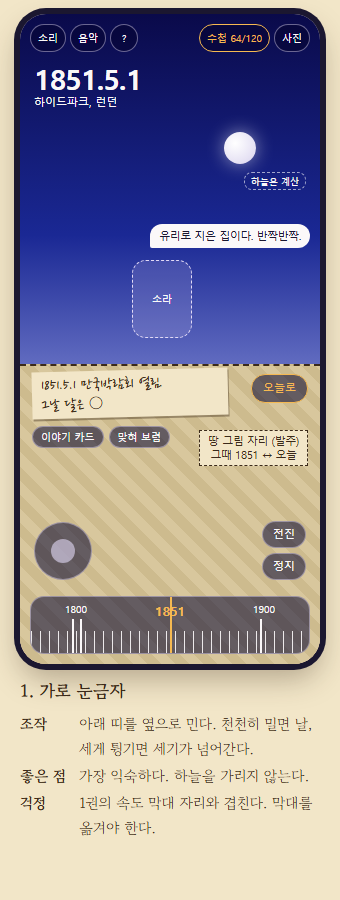
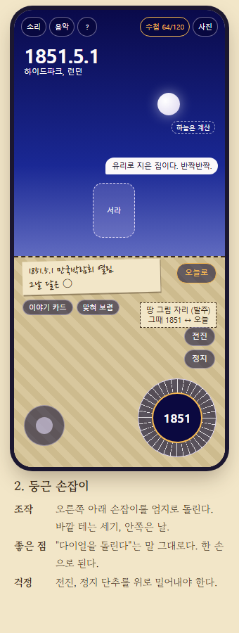
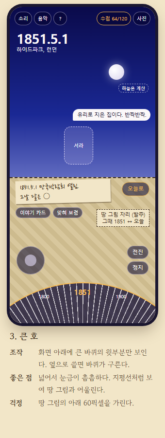
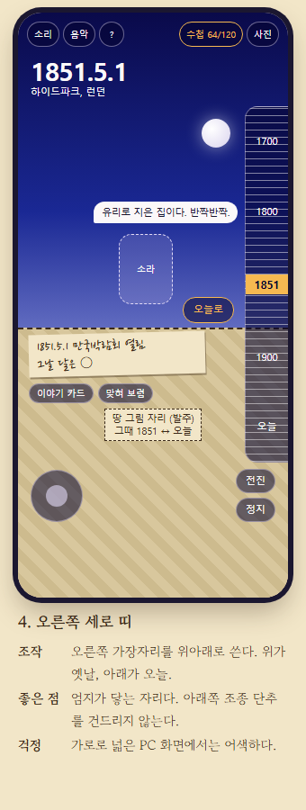
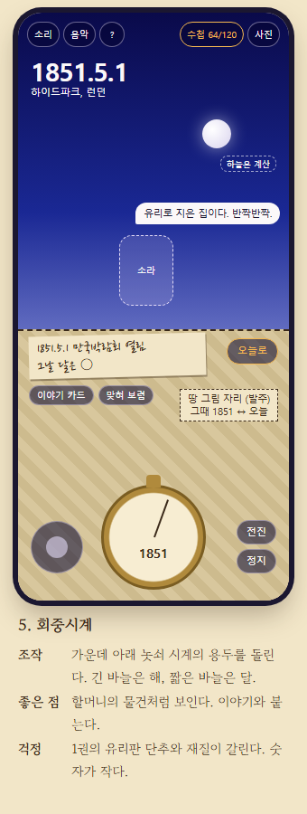
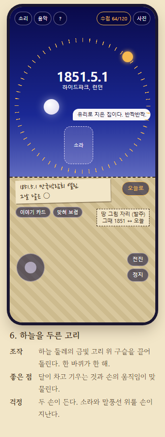
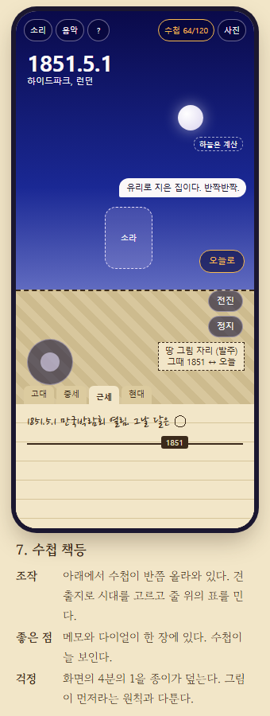
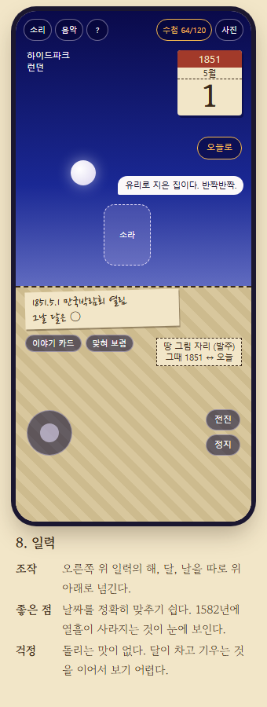
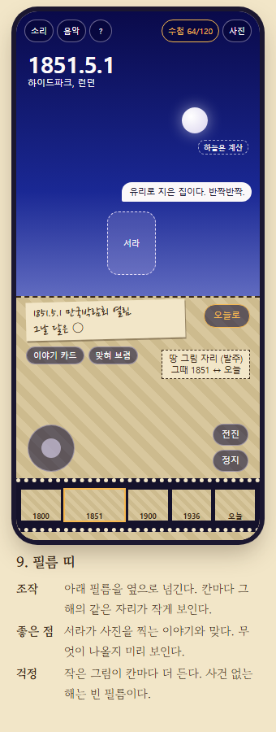
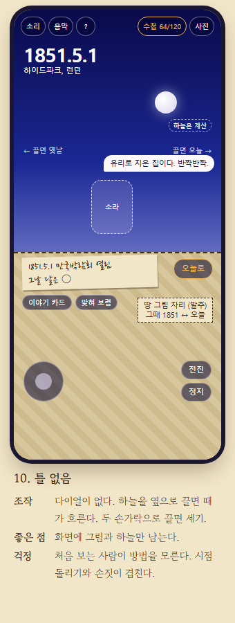

# Time Oddity — 시간 한량

할머니 대신 지난 날로 가서, 그날 그 자리를 구경하고 찍어 오는 교육용 게임이다.
[Space Oddity — 우주 한량](https://github.com/destory1984/oddity_claude)(1권)의 다음 편이다. 1권이 "못 가는 곳"이었다면 2권은 "못 가는 때"다.

## 지금 상태

아직 게임 코드가 없다. 2026.10.7에 쓴 문서 3편과 다이얼 시험판 1개가 있다.

- [기획서 「할머니의 수첩 2권」](docs/기획서-수첩-2권.md)
- [화면 견본 10](docs/ui-samples.html)
- [그래픽 발주서 1: 그림체 시험 10장](docs/art-order-test-10.md)

기획서는 뼈대다. 날짜, 자리, 대사는 처음 잡아 본 것이고, 만들기 전에 원 자료로 확인한다.

## 화면 견본 10

칸 하나의 화면을 10가지로 짜 보았다. 장면은 모두 1851년 5월 1일 하이드파크이고, 다이얼의 생김새와 자리만 다르다. 빗금 친 칸은 그림이 들어갈 자리다. 그림은 [발주서](docs/art-order-test-10.md)로 따로 주문한다. 달의 모양과 자리는 임시다.

| | | |
|:---:|:---:|:---:|
|  |  |  |
|  |  |  |
|  |  |  |
|  | | |

견본의 원본은 [docs/ui-samples.html](docs/ui-samples.html)이다. 내려받아 브라우저로 열면 10개가 한 쪽에 보인다.

## 다이얼 손맛 시험

견본 3, 4, 9번을 손으로 끌어 볼 수 있게 만들었다. 손전화로 열어 보면 가장 잘 알 수 있다.

- 열어 보기: https://destory1984.github.io/time-oddity_claude/docs/dial-proto.html
- 원본: [docs/dial-proto.html](docs/dial-proto.html)

위쪽 단추 4개로 다이얼을 바꾼다.

| 단추 | 다이얼 | 끄는 법 |
|---|---|---|
| 해 큰 호 | 아래의 큰 바퀴 | 옆으로 끈다 |
| 해 세로 띠 | 오른쪽 가장자리의 띠 | 위아래로 끈다 |
| 3 큰 호 | 앞선 안. 단위를 단추로 고른다 | 옆으로 끈다 |
| 9 필름 띠 | 앞선 안. 칸에서 칸으로 넘어간다 | 옆으로 넘긴다 |

"해 큰 호"와 "해 세로 띠"가 지금의 안이다. 둘은 생김새만 다르고 움직임과 소리가 같다.

- 한 칸(12픽셀)에 꼭 1년씩 넘어가서 달과 날이 그대로 남는다.
- 사건이 있는 해에 멈추면 그날에 걸린다. 1851년에만 세우면 1851.5.1이 된다.
- 굴렸다가 놓으면 1.5초쯤에 걸쳐 느려지다가 가장 가까운 눈금에 선다.
- 눈금 하나를 넘을 때마다 톱니 걸리는 소리가 난다. 소리의 중심은 1,200Hz이고, 10칸째는 760Hz로 조금 낮고 크다. 소리는 화면을 처음 누른 뒤부터 난다.
- 날 단위로 맞출 일은 120칸 가운데 "하늘로 날짜 맞히기" 놀이뿐이라, 날 다이얼은 따로 두지 않는다. "날 맞추기" 단추를 켠 동안에만 한 칸이 하루가 된다.
- 먼 시대는 다이얼로 가지 않는다. 수첩에서 칸을 눌러 간다(시험판에는 수첩이 없다).
- "오늘로" 단추를 누르면 2026.10.7로 간다. 다시 누르면 1851.5.1로 돌아온다.

시험판이라 게임 코드가 아니다. 땅 그림은 빈 칸이고, 달 모양과 별의 움직임은 어림 계산이다.

### 의견을 주는 법

[이슈](https://github.com/destory1984/time-oddity_claude/issues)에 적어 주면 된다. 이 세 가지가 궁금하다.

1. 큰 호와 세로 띠 가운데 어느 쪽이 손에 잘 붙는가.
2. 1851.5.1을 다시 찾아가는 데 얼마나 걸렸는가.
3. 손전화를 한 손으로 쥐고 엄지로 돌릴 수 있었는가.

쓴 기기(손전화 이름, 브라우저)도 함께 적어 주면 좋다.

## 무엇을 하는 게임인가

- 자리는 날고, 때는 돌린다. 지구 위를 날아 자리를 고르고, 다이얼을 돌려 날짜를 고른다.
- 수첩의 칸은 120개다. 기원전 2560년 대피라미드부터 2019년 블랙홀 첫 사진까지, 세계사의 큰 날 120곳이다.
- 칸에 서면 세 가지를 본다.

| 갈래 | 무엇 | 채우는 법 |
|---|---|---|
| 날 | 세계사의 큰 날 | 그날 그 자리에 선다 |
| 하늘 | 그날 밤의 달과 행성 | 하늘을 한 번 올려다본다 |
| 남은 것 | 그 자리에 지금 남은 것 | 다이얼을 오늘로 돌린다 |

- 하늘은 그림이 아니라 계산이다. 그날 그 자리 그 시각의 달, 행성, 별자리를 그대로 그린다.
- 다이얼을 돌리면 같은 구도에서 그때와 오늘이 바뀐다. 1851년 하이드파크의 수정궁은 오늘로 돌리면 잔디밭이다. 그래서 칸마다 그림이 2장이고, 모두 240장이다.
- 마지막 칸은 아직 오지 않은 날, 2061년 7월 핼리 혜성의 귀환이다.

## 지키는 것

- 날짜, 자리, 남은 것은 모두 실제다. 지어낸 사건과 인물은 없다. 할머니만 지어낸 인물이다.
- 사람의 얼굴은 그리지 않는다. 사람이 죽는 순간은 보지 않는다.
- 시간에 쫓기지 않는다. 죽지 않고, 점수가 깎이지 않는다.
- 서버, 계정, 광고가 없다.
- 글보다 그림이 먼저다. 할머니 메모 한 줄 25자, 소라 한 줄 25자, 카드 3문장을 넘기지 않는다.

## 누구를 위한 게임인가

어른이다. 세계사 교과서를 한 번 덮은 적 있는 어른, 박물관과 유적 여행을 좋아하는 어른.

## 만들기 전에 확인할 것

기획서 14절에 6가지를 적어 두었다. 앞의 3가지가 먼저다.

1. 브라우저에서 기원전 2560년의 하늘까지 계산할 수 있는가. 세차운동이 들어가는가.
2. 다이얼 조작이 손전화에서 되는가.
3. 다이얼을 돌리는 동안 그때와 오늘 그림을 어떻게 바꿔 그리는가.

## 1권과의 관계

- 인물(소라, 할머니), 세 목소리(메모, 덧글, 답장), 조종 방식을 1권에서 그대로 잇는다.
- 1권은 Vite와 Babylon.js로 만들었다. 2권도 지구 근처 비행과 하늘 코드를 다시 쓸 생각이다.

## 라이선스

[MIT](LICENSE)다. 다만 1권의 그림과 캐릭터는 1권 저장소의 라이선스를 따른다.
