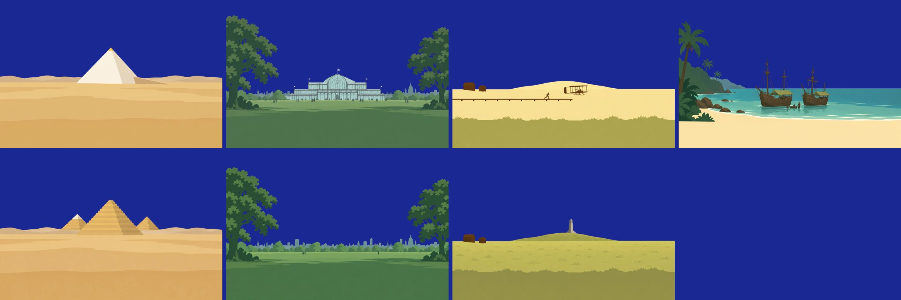
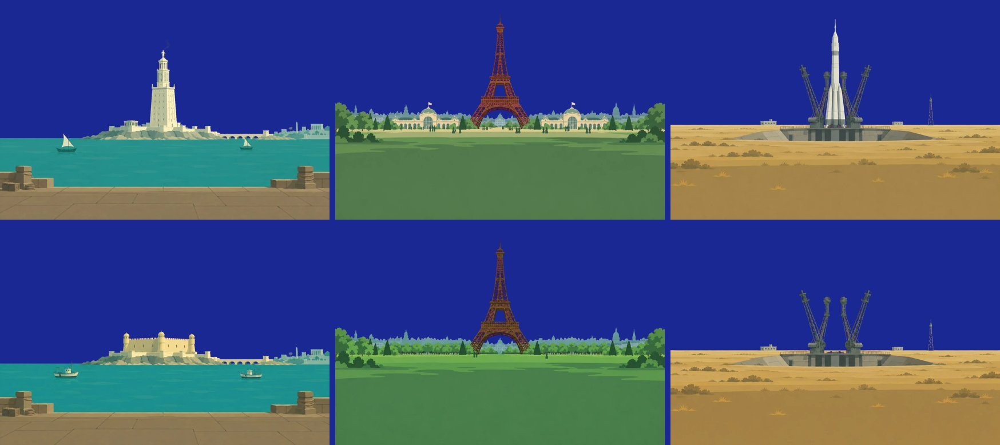

# 그래픽 발주서 2: 첫 토막의 땅 그림 8장

- 쓴 날: 2026.10.7. 받은 날: 2026.10.7(8장 모두, 다시 주문한 것 없음)
- 그리는 손: 챗GPT의 그림 그리기. 사람 손을 거치지 않고 Codex CLI로 넣었다(`tools/art-order.sh`).
- 주문한 것: 첫 토막의 칸 넷(1 대피라미드, 39 콜럼버스의 월식, 64 수정궁, 82 12초의 비행), 칸마다 "그때" 1장과 "오늘" 1장
- 그림체와 규칙은 `art-order-test-10.md`(발주서 1)의 2절, 3절, 4절 그대로다. 달라진 것만 적는다.
- 사용자가 2026.10.7에 "그래픽 외주도 여유 있게 사용해도 되"라고 해서, 임시 그림을 그리지 않고 바로 주문했다.

받은 8장(위가 그때, 아래가 오늘. 하늘을 지우고 남색 바탕에 얹은 것):

## 1. 발주서 1과 달라진 것

| 무엇 | 발주서 1 | 이번 |
|---|---|---|
| 하늘 | 투명하게 | `#ff00ff` 한 가지 색으로 칠하게 하고, 받아서 지운다(`tools/key-sky.py`). 투명 배경은 그림 모델이 잘 지키지 않는다 |
| 참고 사진 | 자리마다 공개 사진 1장 | 넣지 않았다. 글로만 묘사했다. 세부(건물의 생김새)는 원 자료와 견주지 않았다 |
| 참고 그림 | 소라 `idle-1.png` | 같다. "이 캐릭터는 그리지 말고 색의 세기만 참고"라고 적었다 |
| "오늘"의 참고 | 먼저 받은 "그때" | 같다. 구도가 20픽셀 안으로 맞았다 |

## 2. 주문한 차례

1. "그때" 넉 장을 한꺼번에 넣었다. 한 장에 1 → 3분 걸렸다.
2. 받은 것을 한 장에 모아 보고, 그 그림을 참고로 넣어 "오늘" 넉 장을 넣었다.
3. `tools/key-sky.py` 로 하늘을 지우고 WebP로 바꿨다. 한 장에 17 → 82KB다.

## 3. 장면의 글

AI에 넣은 문장은 `tools/art-order.sh` 가 앞머리를 붙여 만든다. 장면마다 바꾼 것은 색 계열과 묘사다.

| 칸 | 색 계열 | 그때 | 오늘 |
|---|---|---|---|
| khufu | 모래의 누런색, 돌의 흰색, 먼 언덕의 옅은 갈색 | 막 다 지은 대피라미드 1기. 흰 석회암으로 매끈하게 덮이고 꼭대기에 금빛 뾰족돌. 평평한 모래 벌판, 낮은 흙 경사로. 남쪽에서 북쪽을 본 구도 | 겉돌이 벗겨져 누런 돌이 계단처럼 드러남. 뒤쪽에 다른 피라미드 2기 |
| lunar1504 | 바다의 청록색, 모래의 옅은 누런색, 나무와 배의 짙은 풀색과 갈색 | 잔잔한 만. 얕은 물에 얹힌 낡은 범선 두 척, 갑판에 야자잎 지붕. 왼쪽에 야자나무 곶. 모래밭에 작은 사람 실루엣 | 배가 없다. 같은 만과 곶. 작은 나무 부두와 고깃배 한 척 |
| crystalPalace | 잔디의 풀색, 유리의 옅은 청록색, 쇠의 짙은 회색 | 유리와 쇠로 지은 길고 낮은 전시관, 가운데 둥근 유리 지붕. 잔디밭, 양옆에 큰 느릅나무, 사람 실루엣 | 건물이 없다. 잔디밭과 나무만 |
| kittyHawk | 모래의 옅은 누런색, 마른 풀의 황록색, 헛간과 비행기의 짙은 갈색 | 평평한 모래 벌판, 뒤에 큰 모래 언덕. 긴 나무 레일 끝에서 낮게 뜬 복엽기, 곁에서 달리는 한 사람, 멀리 헛간 두 채 | 풀로 덮인 언덕 꼭대기에 회색 돌 기념탑. 헛간은 그대로 |

글 전체는 `tools/` 가 아니라 작업 폴더(`assets/codex/slice1/*.txt`, 커밋하지 않음)에 있었다. 다시 주문할 때는 이 표와 발주서 1의 10절로 다시 쓴다.

## 4. 받고 확인한 것

| 확인 | 결과 |
|---|---|
| 하늘이 한 가지 자홍색인가 | 8장 모두 그렇다. 지운 뒤 가장자리에 분홍 테가 남지 않았다 |
| 그때와 오늘의 구도가 같은가 | 지평선의 높이가 장마다 0.2%p 안으로 같다(0.521과 0.519, 0.627과 0.629, 0.600과 0.600, 0.597과 0.597) |
| 글자, 숫자, 얼굴이 없는가 | 없다 |
| 지평선이 아래에서 45%인가 | **아니다.** 37 → 48%로 장면마다 다르다. 그래서 게임이 그림마다 지평선의 높이를 재어 맞춘다 |
| 밤하늘 위에서 윤곽이 또렷한가 | 그렇다. 게임이 밤에는 그림을 어둡게 눌러 쓴다 |
| 소라가 묻히지 않는가 | 묻히지 않는다 |

## 5. 아직 보지 않은 것

- 세부가 사실과 맞는지. 수정궁의 층수와 깃발, 피라미드 곁의 2기가 놓인 자리, 키티호크 기념탑의 생김새, 1504년 배의 꼴. 게임에 굳히기 전에 원 자료와 견준다.
- 사용자가 그림체를 좋다고 하는지. 이 8장은 사용자가 보기 전에 넣었다.

## 6. 더 주문한 6장 (2026.10.7, 사용자가 자리를 비운 사이)

칸 셋을 더 넣으면서 같은 방법으로 6장을 더 받았다. 6장 모두 한 번에 받았다.

| 칸 | 색 계열 | 그때 | 오늘 |
|---|---|---|---|
| pharos | 바다의 청록색, 돌의 옅은 누런색과 흰색, 땅의 갈색 | 바다로 뻗은 바위섬 끝의 3단 등대(네모, 여덟 모, 둥근 단), 꼭대기에 조각상과 가는 연기. 돛배 두 척, 앞쪽에 돌 부두 | 등대가 없고 같은 자리에 낮고 네모난 누런 돌 성채. 고깃배 두 척 |
| eiffel | 잔디와 나무의 풀색, 쇠의 짙은 갈색, 건물의 옅은 크림색 | 막 다 지은 에펠탑, 발치 좌우에 박람회 전시관들. 흙마당과 사람 실루엣 | 탑은 그대로, 전시관이 없고 나무 줄과 잔디밭 |
| sputnik | 마른 풀밭의 황토색, 쇠의 짙은 회색, 로켓의 옅은 회백색 | 초원의 발사대 위에 선 로켓, 받침 팔 넷, 멀리 건물과 철탑 | 로켓이 없고 받침 팔만 벌어져 서 있음 |

- 그림체를 잇기 위해 먼저 받은 `crystalPalace-then.png` 를 참고 그림으로 함께 넣고 "그림체만 맞추고 내용은 그리지 말 것"이라고 적었다. 앞의 8장과 한 손으로 그린 것처럼 나왔다.
- 지평선의 높이는 그때와 오늘이 소수 셋째 자리까지 같았다(0.628, 0.522, 0.567).
- 에펠탑은 붉은 갈색으로 와서 자홍색 하늘과 가까웠지만, 하늘을 지울 때 탑이 깎이지 않았다.
- 5절의 "아직 보지 않은 것"은 이 6장에도 같다. 등대의 생김새는 남은 그림이 없어 어차피 상상이고, 성채(카이트베이 요새)와 발사대의 세부는 원 자료와 견주지 않았다.
