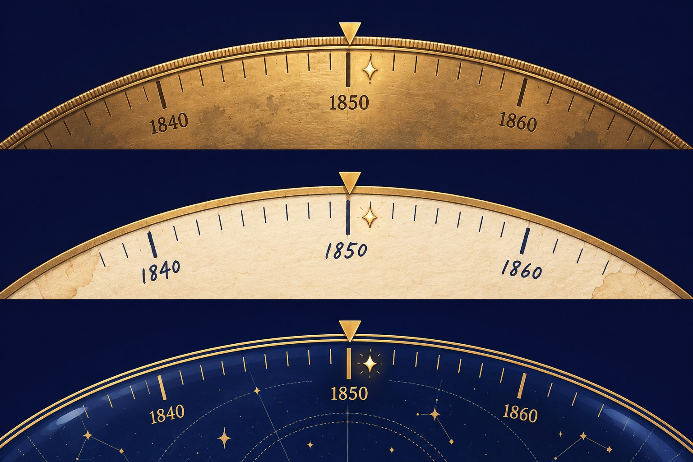
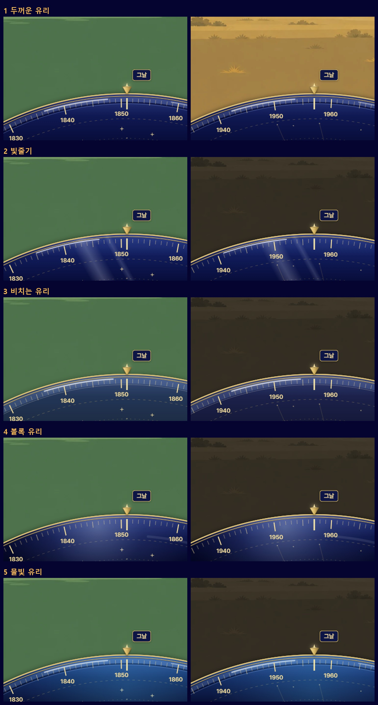

# 다이얼의 생김새를 GPT와 상의한 것

- 한 날: 2026.10.7
- 까닭: 사용자가 첫 토막의 다이얼을 보고 "아무래도 좀 저렴해 보인다, gpt하고 상의해 봐"라고 했다.
- 한 일: 게임 화면과 다이얼을 키운 그림 두 장을 Codex CLI로 GPT에 보여 주고, 왜 저렴해 보이는지와 고칠 방향을 물었다. 시안 그림 한 장도 함께 받았다.
- 결과: 먼저 GPT가 권한 A안(먹남색 판에 손때 묻은 놋쇠 테)을 입혀 보였다. 사용자가 "3번"을 골랐고, 그것은 **시안 그림의 셋째 줄, 밤하늘 유리**였다. 지금 게임의 다이얼이 그것이다(`game/src/ui/dialView.js`). 사이에 "3번"을 종이와 놋쇠로 잘못 읽어 한 번 그렸다. 연도 숫자는 GPT의 말대로 손글씨가 아니라 Pretendard다.

## 받은 시안

위에서부터 놋쇠, 종이와 놋쇠, 밤하늘 유리다. 지금 게임에 입힌 것은 이 셋이 아니라 아래 글의 A안이다.

## GPT의 답 (그대로)

지금은 **놋쇠 물건보다 ‘금색 테두리를 두른 남색 조작판’으로 읽힙니다.** 금색을 더 넣기보다, 얇은 두께·절제된 반사·눈금의 위계를 만드는 편이 좋습니다.

**1. 저렴해 보이는 가장 큰 까닭 다섯 가지**

1. **면적에 비해 재질 정보가 없습니다.** 전체 화면에서 남색 면이 하단을 크게 차지하는데, 확대 그림에서는 그 면이 거의 단색입니다. 작은 놋쇠 소품이라는 설정보다 큰 플라스틱 판처럼 보입니다.
2. **금색 외곽선이 물건의 두께를 대신합니다.** 풀밭과 남색 사이에 밝은 선 하나만 있어, 금속의 윗면·옆면·그림자가 구분되지 않습니다. 빛을 받는 금속보다 도형의 테두리에 가깝습니다.
3. **삼각 바늘과 ‘그날’이 너무 직접적인 UI 기호입니다.** 밝은 노란 삼각형, 같은 색 글씨, 굵은 세로선이 한곳에 몰립니다. 수첩 속 물건보다 게임의 안내 화살표가 먼저 보입니다.
4. **눈금과 숫자가 모두 강하게 떠 있습니다.** 흰 눈금이 금색 테두리 바로 아래에 빽빽하게 붙고, 숫자는 기울어져 있습니다. 확대본에서는 눈금과 숫자가 표면에 새겨졌다기보다 위에 얹힌 듯 보입니다.
5. **주변 그림과 가장자리의 성격이 다릅니다.** 땅은 종이를 겹친 듯한 부드러운 색면인데, 다이얼은 날카로운 원호와 높은 명암 대비를 갖습니다. 화면의 일부보다 별도 위젯처럼 붙어 있습니다.

**2. 고칠 방향 세 가지**

모두 현재 반지름 약 431픽셀과 한 해 12픽셀을 유지합니다. 금속을 나타내는 빛은 낮과 밤에 따라 번쩍이게 하지 말고, 약한 고정광으로 처리합니다.

**A. 손때 묻은 놋쇠 테두리와 먹남색 판 — 권장**

- **재질과 빛:** 안쪽은 무광 도장, 둘레만 닳은 놋쇠. 위쪽에 넓고 약한 밝기 변화, 아래쪽에 짙은 색을 둡니다. 반사 띠는 가늘고 끊김 없이.
- **색:** 면 `#252A35` → `#171C26`, 놋쇠 `#A58A56`, 빛 받은 모서리 `#C7AE77`, 옆면 `#62513A`, 글자 `#DDD5C4`. 면은 거의 불투명하게 해 배경에 따라 색이 흐려지지 않게 합니다.
- **눈금과 숫자:** 1년 눈금은 1픽셀 폭·7픽셀 길이, 5년은 11픽셀, 10년은 17픽셀. 짧은 눈금은 긴 눈금보다 흐리게. 숫자는 Pretendard Medium 12픽셀, 원호를 따라 배치하되 글자 자체는 수평으로.
- **바늘:** 아래를 가리키는 폭 7·높이 11픽셀의 가는 놋쇠 혀. 가운데에 어두운 선 하나와 한쪽 모서리의 밝은 선만 넣습니다.
- **테두리와 그림자:** 총 4픽셀 안에서 밝은 윗모서리, 놋쇠 몸체, 어두운 안쪽 경계를 나눕니다. 바깥 그림자는 아래로 2픽셀, 흐림 4픽셀, 검정 20%.
- **그날/오늘과 끝 딱지:** 해당 연도의 눈금 끝에 지름 3픽셀 놋쇠 점. 이름은 개별 눈금 위의 작은 먹남색 받침에 나눔손글씨 펜 12픽셀로. 바늘과 겹치면 받침을 옆으로 옮기고 가는 연결선을 둡니다. 끝의 알약은 둥근 모서리 3픽셀의 작은 표찰로 바꾸고, 금색 채움 대신 남색 바탕·놋쇠 글씨·작은 방향 꺾쇠를 사용합니다.
- **굴릴 때:** 판과 눈금은 함께 움직이고 바늘은 고정. 한 칸이 걸릴 때 바늘만 1픽셀 내려갔다가 80밀리초 안에 복귀합니다. 손을 놓으면 가장 가까운 칸에 짧게 정착합니다.
- **별도 이미지:** 필요 없습니다. 원한다면 아주 약한 놋쇠 얼룩 질감 1장만 둘레에 제한해 얹을 수 있습니다.

**B. 오래된 놋쇠 원판에 새긴 연도**

- **재질과 빛:** 원판 전체가 산화된 무광 놋쇠. 넓은 그라디언트와 성긴 미세 선으로 결을 표현하고, 닳은 바깥 가장자리만 조금 밝게 합니다.
- **색:** 면 `#8C7853` → `#65563E`, 모서리 `#B39B6A`, 새김 `#302D27`, 새김 아래쪽 빛 `#C0AA7B`.
- **눈금과 숫자:** 길이는 A와 동일. 어두운 눈금 아래에 밝은 선을 0.5픽셀 어긋나게 겹쳐 얕은 음각을 만듭니다. 숫자는 Pretendard Medium 12픽셀, 수평 배치. 작은 숫자에는 이중 음각 효과를 생략해 선명도를 지킵니다.
- **바늘:** 폭 5·높이 12픽셀의 짙은 남색 마름모. 중앙의 작은 놋쇠 못으로 고정된 모양.
- **테두리와 그림자:** 둥글게 닳은 3픽셀 가장자리와 1픽셀 어두운 옆면. 그림자는 아래로 2픽셀, 흐림 3픽셀.
- **그날/오늘과 끝 딱지:** 해당 연도에 작은 남색 점을 박고, 이름은 어두운 잉크색의 손글씨로 표시합니다. 이름 뒤에는 얇은 밝은 놋쇠 받침을 둡니다. 끝 표찰도 같은 놋쇠색에 남색 글씨와 꺾쇠.
- **굴릴 때:** 결·얼룩·눈금이 모두 원판에 붙어 움직입니다. 반사광만 고정해 금속이 빛 아래를 지나가는 느낌을 줍니다. 칸마다 바늘이 1도 이내로 미세하게 흔들립니다.
- **별도 이미지:** 얼룩과 미세한 금속 결 1장을 주문하면 유리합니다. 사진처럼 선명한 긁힘은 피합니다.

설정에는 가장 충실하지만, 넓은 갈색 면이 풀밭과 사막을 무겁게 덮을 수 있습니다.

**C. 할머니 수첩의 종이 눈금과 얇은 놋쇠 고리**

- **재질과 빛:** 먹남색 몸체 위에 폭 32픽셀의 오래된 종이 눈금 띠를 끼운 모습. 종이는 무광, 놋쇠 고리만 약한 빛을 받습니다.
- **색:** 몸체 `#242831`, 종이 `#C8BEA5` → `#B3A88E`, 잉크 `#393B3C`, 놋쇠 `#9B8151`, 모서리 빛 `#C0A675`.
- **눈금과 숫자:** 종이 띠에 짙은 잉크로 인쇄. 길이는 A와 동일하고 숫자는 Pretendard Medium 12픽셀. 손글씨는 연도에 쓰지 않습니다.
- **바늘:** 폭 6·높이 10픽셀의 짧은 놋쇠 집게. 종이 띠 바깥에서 끝만 눈금을 향합니다.
- **테두리와 그림자:** 바깥 놋쇠 고리 2픽셀, 종이 아래에 1픽셀 접촉 그림자. 종이를 찢거나 모서리를 크게 말지 않습니다.
- **그날/오늘과 끝 딱지:** 종이 띠 위쪽에 작은 남색 잉크점과 손글씨 이름. 끝 표시는 같은 종이색의 폭 약 45·높이 20픽셀 책갈피 모양으로, 남색 글씨와 꺾쇠를 넣습니다.
- **굴릴 때:** 종이와 고리가 함께 움직입니다. 칸이 걸릴 때 집게 끝만 1픽셀 들렸다 돌아옵니다.
- **별도 이미지:** 없어도 됩니다. 필요하면 흐린 종이 결 1장만 사용합니다.

수첩과 땅 그림에는 가장 잘 어울리지만, ‘놋쇠 다이얼’보다 ‘종이 연표’로 읽힐 가능성이 있습니다.

**3. 추천: A**

소라의 남색·금색과 연결되면서, 큰 금속 면이나 밝은 종이 면을 추가하지 않습니다. **지금 형태를 유지하고도 재질과 읽기 쉬움을 가장 확실하게 개선할 방향입니다.**

그리는 차례는 다음과 같습니다. 치수는 375픽셀 너비 기준입니다.

1. **하단 영역 설정:** 화면의 `y=672 → 812`, 높이 140픽셀 안으로 모든 그림과 그림자를 제한합니다. 이 영역 전체를 옆으로 미는 입력 범위로 유지합니다.
2. **원호 배치:** 반지름 431픽셀. 바늘과 원호 정점을 `x=188`에 맞추고, 정점은 영역 위에서 44픽셀 아래인 `y=716`에 둡니다. 양끝의 원호는 정점보다 약 43픽셀 내려갑니다.
3. **바깥 그림자:** 원판 모양에 아래 방향 2픽셀, 흐림 4픽셀, 검정 20% 그림자를 그립니다.
4. **판 채우기:** 윗부분 `#252A35`, 아래 `#171C26`의 완만한 그라디언트. 불투명도 96% 정도로 배경의 영향만 약하게 남깁니다.
5. **놋쇠 둘레:** 외곽에서 안쪽으로 밝은 모서리 0.75픽셀, 놋쇠 몸체 2픽셀, 어두운 안쪽 경계 1픽셀을 그립니다. 밝은 선은 불투명도 60%로 억제합니다.
6. **눈금:** 안쪽 경계에서 3픽셀 떨어져 시작합니다. 간격 12픽셀, 폭 1픽셀. 길이는 7·11·17픽셀. 모두 중심을 향하게 하고, 1년 눈금은 `#DDD5C4`의 55%, 10년 눈금은 90%.
7. **연도 숫자:** 긴 눈금 끝에서 7픽셀 안쪽에 Pretendard Medium 12픽셀로 배치합니다. 수평 정렬하고 글자 그림자는 넣지 않습니다.
8. **사건 표시:** 해당 눈금을 1.5픽셀 폭의 놋쇠색으로 바꾸고 끝에 지름 3픽셀 점을 둡니다. 이름 받침은 글자 너비에 좌우 여백 5픽셀씩, 높이 20픽셀. 고정 바늘과 이름 사이에는 최소 4픽셀 여백을 확보합니다.
9. **고정 바늘과 끝 표찰:** 바늘은 폭 7·높이 11픽셀, 끝이 원호 위에 닿도록 배치합니다. 끝 표찰은 최소 45×20픽셀, 좌우 화면 끝에서 8픽셀 안쪽. 글씨는 Pretendard 11픽셀 이상으로 유지합니다.
10. **움직임 연결:** 판·둘레·눈금·사건 표시는 한 덩어리로 굴립니다. 12픽셀마다 한 해와 톱니 소리를 맞추고, 고정 바늘에만 1픽셀 반응을 줍니다. 정착 시간은 약 100밀리초, 큰 탄성이나 광택 애니메이션은 쓰지 않습니다.

낮 풀밭에서는 어두운 판이 숫자의 대비를 확보하고, 밤 사막에서는 가는 놋쇠 모서리가 형태를 남깁니다. **흰 눈금과 노란 바늘의 밝기를 낮추고, 둘레에만 금속의 두께를 주는 것**이 가장 먼저 할 수정입니다.
## 유리 느낌 시안 다섯 (2026.10.7)

사용자가 밤하늘 유리를 보고 "유리 느낌이 좀 더 나도록 시안 5개 만들어서 보여줘"라고 했다. 이번에는 그림을 주문하지 않고 게임의 다이얼을 다섯 가지로 실제로 그려, 번호를 그림에 박아 보였다. 왼쪽이 낮(수정궁), 오른쪽이 밤(첫 인공위성)이다.

| 번 | 이름 | 무엇을 더했나 |
|---:|---|---|
| 1 | 두꺼운 유리 | 테 안쪽에 빛 띠와 어두운 선, 위쪽에 가는 반사 |
| 2 | 빛줄기 | 비스듬한 빛 두 줄과 테 위의 반짝임 |
| 3 | 비치는 유리 | 유리를 60%만 불투명하게, 가장자리에 빛 |
| 4 | 볼록 유리 | 한쪽에 부드러운 빛 한 점, 양 끝을 어둡게 |
| 5 | 물빛 유리 | 더 푸른 빛, 속에서 배어 나오는 빛, 1번의 두께 |

- 주소 끝에 `?dial=1` → `?dial=5` 를 붙이면 그 모습으로 굴려 볼 수 있다. 붙이지 않으면 더하기 전의 모습(0번)이다.
- 그림 첫 줄 오른쪽(1번의 밤)만 땅이 밝게 찍혔다. 머리 없는 크롬이 밤의 빛을 입히기 전에 찍은 것이고, 다이얼은 다른 줄과 같은 조건이다.
- 사용자의 답을 기다린다.

## 유리 느낌 시안 2차 (2026.10.7)

1차 다섯을 본 사용자의 말: "두꺼운 유리이며, 가장자리가 살짝 빛나고, 색깔은 1번보다 약간 더 짙은 네이비, 별 자리가 조금 더 눈에 띄면 좋겠어. 시안 5개 준비해." 다섯 모두 그 넷을 지키고, 빛의 색과 유리의 두께와 별을 그리는 법만 다르다. 1차의 다섯은 걷어 냈다.

| 번 | 이름 | 다른 점 |
|---:|---|---|
| 1 | 금빛 가장자리 | 가장자리에 금빛이 은은히 번진다. 바탕이 되는 안 |
| 2 | 푸른빛 가장자리 | 번지는 빛이 푸르다. 조금 더 세다 |
| 3 | 별자리 또렷하게 | 별이 더 많고, 선이 굵고 밝다. 작은 별가루가 깔린다 |
| 4 | 더 두꺼운 유리 | 테 안쪽의 빛 띠가 9픽셀에서 15픽셀로. 남색이 한 단계 더 짙다 |
| 5 | 흰 별자리 | 별과 선이 금색이 아니라 푸른 흰빛이다. 별가루가 깔린다 |

다이얼만 네 배로 키운 그림이 시안마다 한 장씩 있다(위는 낮, 아래는 밤): `art/dial-round2-1.jpg` → `art/dial-round2-5.jpg`. 한 장에 열 칸을 모은 그림(`art/dial-glass-round2.jpg`)은 사용자가 "너무 작아서 안 보여"라고 했다. **시안은 고를 부분만 크게 잘라, 하나에 한 장씩 보인다.**

주소 끝에 `?dial=1` → `?dial=5` 를 붙이면 굴려 볼 수 있다. 사용자의 답을 기다린다.
